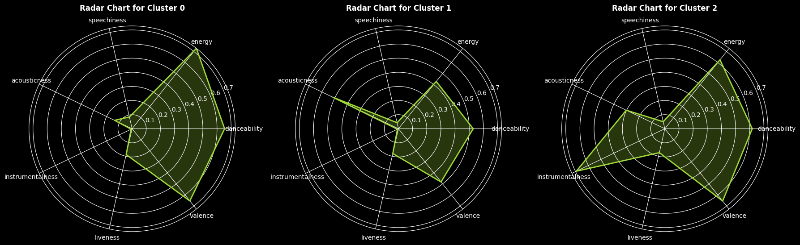
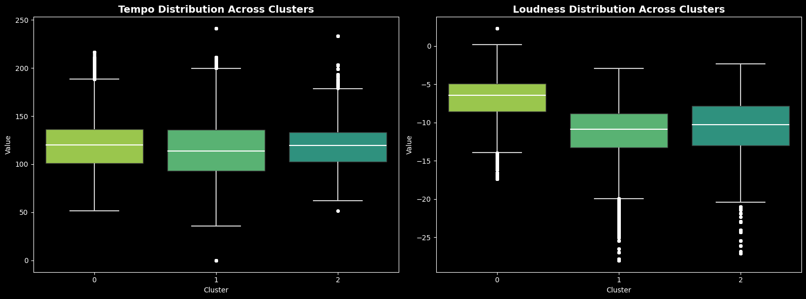
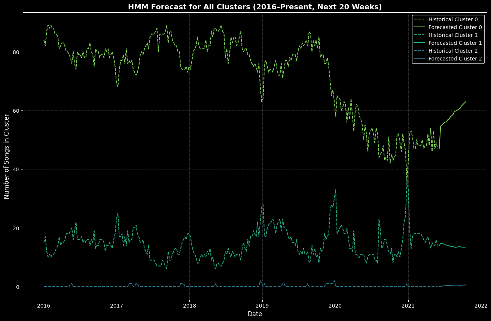

# Algorithmic Marketing
Final Project for the University of Chicago's MS in Applied Data Science Program Course: Data Science for Algorithmic Marketing

## Motivation
We aimed to analyze audio features from the Billboard Hot 100 Songs of the past two decades to uncover insights about what makes a hit record.

## Dataset
Our dataset is sourced from Billboard Hot 100 songs from 1958 to 2021 and the accompanying audio features generated by Spotify and queried through the Spotify API. The dataset can be found [here](https://www.kaggle.com/datasets/thedevastator/billboard-hot-100-audio-features/).

## Modeling
The full code can be found in [this notebook](https://github.com/alvinyao14/Algorithmic-Marketing/blob/main/Cluster%20Modeling%20%26%20Trend%20Analysis.ipynb).

----
## Song Cluster Profiling

After checking feature correlation, we conclude that there aren’t any correlated feature pairings that are so egregious we should remove them. Additionally, when considering conducting PCA, we could not reduce a significant number of variables, so we opted to train on the nine selected numerical variables to maximize interpretability. Utilizing the Elbow method, we find that generating 3 clusters is both the most optimal and most interpretable number of clusters.

We were able to generate three profiles:

The three profiles we've described are as follows:

**Dancefloor Anthems**: This cluster is packed with high-energy, danceable tracks that dominate clubbing and workout playlists. With songs like Dance Monkey, Montero (Call Me By Your Name), and Roxanne, this segment appeals to fans of EDM, pop, and rhythmic beats, making it perfect for parties and fitness enthusiasts who thrive on energetic, upbeat music.

**Acoustic Ballads**: Featuring emotional and expressive songs like Memories, Falling, and Lose You To Love Me, this cluster caters to listeners who appreciate introspective and heartfelt music. It's a favorite among indie, acoustic, and soft pop fans, resonating with those who seek soothing, sentimental, and storytelling-driven tunes.

**Atmospheric Tunes**: With tracks like Everything I Wanted, She, and Ilomilo, this cluster is defined by atmospheric, melodic, and highly instrumental music. It attracts fans of lofi, chillwave, and instrumental electronic music, offering an uplifting yet relaxing soundscape that blends well into study sessions, creative work, or laid-back social settings.

The clustering process was completed in collaboration with teammate [Cassandra Chen](https://hnchen.com/)

----
## Profile Trend Forecasts

For model selection, we compared ARIMA (Autoregressive Integrated Moving Average) versus HMM (Hidden Markov Models), finding HMM to have a more favorable RMSE score of 6.74 compared to 8.44 in 5-fold cross-validation. In fine-tuning the HMM model, I compared the performance of 2-5 hidden states, finding 4 hidden states as the most optimal log-likelihood. From that, we predicted the proportion (number of songs) of each profile on the next 20 weekly Billboard Hot 100 charts as a means to forecast the trend of each profile:

